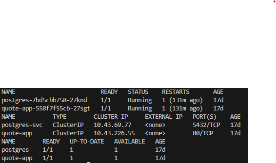
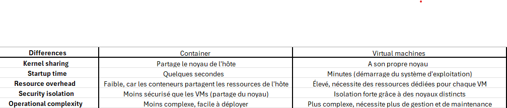
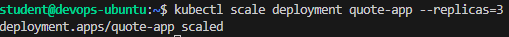
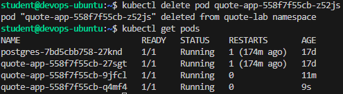
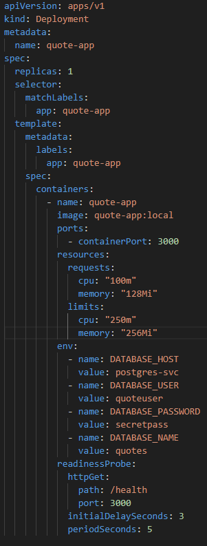
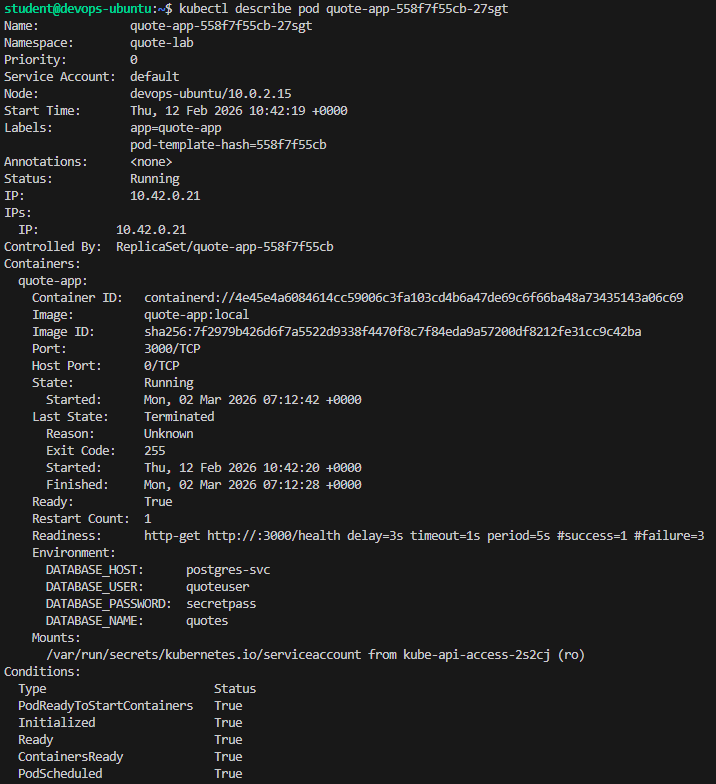
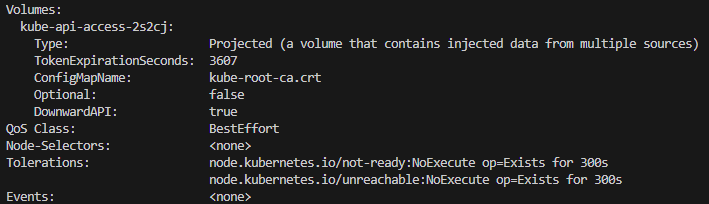
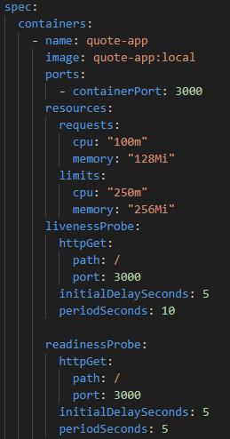

# Architecture Notes - Lab 85: Architecture and Production Design

## Step 1 : Review Your Current Deployment

On run les commandes pour vérifier le setup Kubernetes actuel 

kubectl get pods
kubectl get services
kubectl get deployments



## Step 2 : Map the Current Architecture

### 2.1 Architecture Diagram
```
User / Browser  
↓  
Kubernetes Service  
↓  
Deployment  
↓  
Pods (quote-app containers)  
↓  
PostgreSQL database
```

#### 2.2 Where does isolation happen?
L'isolation se passe au **niveau des pods**, chaque pod fonctionne indépendamment et possède son propre réseau et espace de noms.

#### 2.3 What restarts automatically?
**Les pods** redémarrent automatiquement si un **container** à l’intérieur d’un pod échoue.

#### 2.4 What does Kubernetes not manage?
**Kubernetes** ne gère pas la **persistance des données** de façon native, ce qui est à gérer par des **volumes persistants**.
Il ne gère pas les aspects externes du réseau ou de la sécurité, comme les **firewalls** et les **politiques de sécurité réseau**.

## Step 3 : Compare Containers and Virtual Machines

### 3.1 Comparison Table



#### 3.2 When would you prefer a VM over a container?
Une **VM** est préférable lorsque l’on a besoin d’une **isolation complète**, comme dans des environnements où la sécurité est une priorité. Par exemple, pour des bases de données sensibles ou des applications nécessitant un environnement d’exploitation dédié.

#### 3.3 When would you combine both?
On pourrait **combiner les deux** lorsque l'on a besoin d'utiliser des conteneurs pour des microservices qui nécessitent une **scalabilité rapide**, et des **VMs** pour des services ou des applications qui nécessitent plus d’**isolation** ou de **sécurité**, comme une base de données ou un service monolithique.

## Step 4 : Introduce Horizontal Scaling

### 4.1 Scale Your Deployment

kubectl scale deployment quote-app --replicas=3



## 4.2 Verify the Scaling

kubectl get pods


## 4.3 What changes when you scale?
Lorsque tu fais du scaling, plus de pods sont créés pour gérer une charge accrue. Cela permet à l’application de mieux supporter un nombre plus élevé de requêtes.

## 4.4 What does not change?
La base de données et l’infrastructure sous-jacente ne changent pas. Le scaling touche uniquement le nombre de répliques des pods.

# Step 5 – Simulate Failure

kubectl delete pod quote-app-558f7f55cb-52js



## Who recreated the pod?

The ReplicaSet controller recreated the Pod.

## Why?

Because the Deployment defines a desired state (3 replicas).  
Kubernetes continuously reconciles actual state with desired state.

## What would happen if the node itself failed?

If:
- Single-node cluster → total outage.
- Multi-node cluster → Pods rescheduled on healthy nodes.

# Step 6 – Introduce Resource Limits

J'ajoute au fichier deployment.yaml :



kubectl describe pod quote-app-558f7f55cb-27sgt




## What are requests vs limits?

Requests:
- Minimum guaranteed resources
- Used for scheduling decisions

Limits:
- Maximum allowed usage
- Exceeding memory limit → container killed (OOMKill)
- Exceeding CPU limit → throttling

## Why important in multi-tenant systems?

- Prevent resource starvation
- Ensure fairness
- Improve cluster stability
- Enable predictable scaling


# Step 7 – Add Readiness and Liveness Probes

J'ajoute au fichier deployment.yaml :



## Difference between readiness and liveness

Readiness:
- Determines if Pod receives traffic
- If failing → removed from Service endpoints

Liveness:
- Determines if container is alive
- If failing → container restarted

## Why does this matter in production?

- Prevent sending traffic to broken instances
- Automatic self-healing
- Better availability
- Zero-downtime deployments

# Step 8 – Connect Kubernetes to Virtualization

## What runs underneath k3s?

Under k3s:

Hardware  
→ Host OS (Linux)  
→ Container runtime  
→ k3s (lightweight Kubernetes)  
→ Pods  

## Is Kubernetes replacing virtualization?

No.

Virtualization abstracts hardware.  
Kubernetes abstracts applications.

They solve different layers of the stack.

## In a cloud provider, what hosts your nodes?

Cloud provider infrastructure:

Physical servers  
→ Hypervisor  
→ Virtual Machines  
→ Kubernetes nodes  
→ Containers  

## Architecture in Different Environments

### Cloud Data Center

Physical servers  
→ Hypervisor  
→ VMs  
→ Kubernetes cluster  
→ Applications  

Managed services:
- Load balancer
- Managed database
- Object storage

### Embedded Automotive System

Hardware ECU  
→ Lightweight Linux  
→ k3s  
→ Containers  

Focus:
- Low resource footprint
- Real-time constraints
- Edge computing

### Financial Institution

Physical servers in private data center  
→ Secure hypervisor  
→ Hardened VMs  
→ Kubernetes cluster  
→ Strict network segmentation  

Focus:
- Compliance
- Encryption
- Audit logging
- Zero-trust networking

---

# Step 8 – Design a production architecture

## Production-Ready Architecture

### Infrastructure Layer

- Multiple nodes (minimum 3)
- Nodes distributed across availability zones
- Cloud load balancer
- Private networking

### Kubernetes Layer

- Deployment with multiple replicas
- Horizontal Pod Autoscaler
- Resource limits defined
- Readiness & liveness probes
- Secrets management
- Persistent Volume Claims

### Database Layer

Option A: Managed PostgreSQL outside cluster  
Option B: StatefulSet with persistent volumes  

Production recommendation:
Managed database outside cluster for:
- Automatic backups
- High availability
- Reduced operational risk

### Backup Strategy

- Daily automated DB backups
- Snapshot retention policy
- Disaster recovery tested quarterly

### Monitoring

- Prometheus for metrics
- Grafana dashboards
- Alerts configured (CPU, memory, pod restarts)

### Logging

- Centralized logging (ELK or Loki)
- Log retention policy
- Audit logs enabled

### CI/CD Integration

Pipeline:
- GitHub push
- CI tests
- Docker build
- Image push to registry
- Automated Kubernetes deployment

---

## What runs where?

### In Kubernetes

- Application containers
- Internal services
- Autoscaling
- ConfigMaps & Secrets

### In Virtual Machines

- Kubernetes nodes
- Possibly stateful databases (if not managed)

### Outside the cluster

- Cloud load balancer
- Managed PostgreSQL
- Object storage
- External DNS
- CI/CD platform

---

# Step 9 – Required Break and Analysis

## Controlled Failure Introduced

Failure simulated:
Invalid image name in Deployment.

Result:

kubectl describe pod showed:
ImagePullBackOff

kubectl get events showed:
Failed to pull image

Kubernetes behavior:
- Retries pulling image
- Pod stays in error state
- Does not crash cluster

After fixing image:
Pods recovered automatically.

---

# Step 10 : Required extension: secret-based configuration

Secret created:

kubectl create secret generic quote-db-secret \
  --from-literal=POSTGRES_USER=quote \
  --from-literal=POSTGRES_PASSWORD=quote

Deployment updated to reference secretKeyRef.

## Why is this better than plain-text configuration?

- Prevents credentials in Git repository
- Limits exposure
- Enables RBAC protection
- Better separation of concerns

## Is a Secret encrypted by default?

Secrets are:
- Base64 encoded by default
- NOT encrypted at rest unless encryption is enabled in etcd

Production clusters should enable:
Encryption at rest in etcd.

---

# Final Reflection

This lab demonstrates:

- Desired state reconciliation
- Self-healing infrastructure
- Horizontal scaling
- Failure tolerance
- Production architecture thinking
- Infrastructure layering (Hardware → VM → Kubernetes → Containers)

The key takeaway:

Kubernetes is not just container orchestration.  
It is a distributed systems control plane enforcing desired state.

