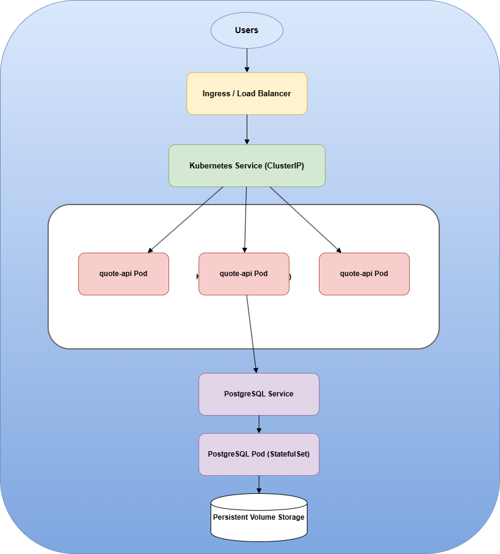

# Step 2 - Current System Problems

## 1. Single Pod Deployment

**Problem**

The system currently runs the application in a single Pod.

**Why it matters**

In a production environment, applications should run with multiple replicas to ensure high availability and reliability.

**Risk**

If the pod crashes or the node fails, the entire service becomes unavailable. This creates a single point of failure.

## 2. Application and Database in the Same Container

**Problem**

The quote-api application and the PostgreSQL database run inside the same container.

**Why it matters**

In production systems, the application and database should be separated so they can be managed, scaled, and maintained independently.

**Risk**

Restarting the pod also restarts the database. It also prevents scaling the application independently from the database.

## 3. Ephemeral Storage

**Problem**

The PostgreSQL database currently uses ephemeral storage inside the container.

**Why it matters**

Containers in Kubernetes are temporary. If a pod is restarted or replaced, all data stored inside the container is lost.

**Risk**

This can lead to permanent data loss when the pod crashes or is redeployed.

## 4. Secrets Stored in Plain Text

**Problem**

Sensitive information such as database credentials are stored as plain text environment variables.

**Why it matters**

Secrets should be stored using Kubernetes Secrets to ensure better security and proper secret management.

**Risk**

Credentials could be exposed through configuration files, logs, or version control.

## 5. No Readiness Probes

**Problem**

The application does not define readiness probes.

**Why it matters**

Readiness probes allow Kubernetes to determine when a pod is ready to receive traffic.

**Risk**

Traffic may be sent to a pod that is still starting or not functioning correctly.
# Step 3 - Production Architecture

The improved architecture focuses on reliability, scalability, and proper separation of components.

Main improvements include:

- Running multiple application pods
- Separating the database from the API
- Adding persistent storage
- Improving scalability

## Architecture Overview

The application runs in a Kubernetes Deployment with multiple replicas.  
A Kubernetes Service exposes the application and distributes traffic across pods.

The PostgreSQL database is deployed separately and uses persistent storage to prevent data loss.

This architecture allows horizontal scaling by increasing the number of application pods when needed.

## Architecture Diagram

## Main Components

### Application Deployment

- Managed by a Kubernetes Deployment
- Runs 3 pods continuously
- Allows horizontal scaling by increasing the number of pods

### Service

- Provides a stable endpoint for the application
- Distributes incoming traffic between the application pods

### PostgreSQL Database

- Deployed separately from the application
- Uses persistent storage
- Ensures data survives pod restarts

### Persistent Storage

- Uses a Persistent Volume and Persistent Volume Claim
- Prevents data loss if the database pod restarts

# Step 4 - Operational Strategy

## Scaling

The system scales horizontally by increasing the number of application pods.

Because the application is managed by a Deployment, Kubernetes can create additional pods when traffic increases.

For example:

- 3 pods during normal operation
- more pods during traffic spikes

The Kubernetes Service automatically distributes traffic between the available pods.

---

## Safe Deployments

Updates are deployed using a rolling update strategy.

Deployment process:

1. A new pod version is created
2. Kubernetes waits until the new pod becomes ready
3. Traffic is gradually redirected
4. Old pods are removed

This ensures that the application remains available during updates.

## Failure Detection

Failures are detected using readiness probes and Kubernetes monitoring.

If a pod becomes unhealthy:

- Kubernetes removes it from the Service
- Traffic is redirected to healthy pods

## Automatic Recovery

Kubernetes controllers maintain the desired state of the system.

The Deployment controller constantly checks the number of running pods.

If a pod crashes or is deleted, Kubernetes automatically creates a new one to replace it.

# Step 5 - Weakest Point

The weakest component of this architecture is the database.

Even though PostgreSQL now uses persistent storage, it still runs as a single instance.

If the database becomes unavailable, the entire application cannot function.

Possible improvements include:

- PostgreSQL replication
- Database clustering
- Automated backups

The database is often the most critical component of the system because it stores all application data.

## 7.4 What part of this system might require virtual machines instead of containers?

The component that might require **virtual machines instead of containers** is the **database layer**, specifically the PostgreSQL database.

### Why the Database Might Use Virtual Machines

While containers are well suited for **stateless applications** like the API, databases are **stateful systems** that require strong guarantees for:

- Data durability
- Stable and high disk I/O performance
- Reliable storage
- Backup and recovery capabilities

Running PostgreSQL on a **virtual machine** can provide more predictable performance and better control over system resources compared to containers.

### Advantages of Using a VM for the Database

Using a VM for the database provides several benefits:

- Dedicated CPU, memory, and storage
- Better control over disk configuration
- Easier backup and disaster recovery strategies
- Stronger isolation from the container orchestration environment

### Typical Hybrid Architecture

A common production architecture combines both technologies:

- **Application layer:** containers managed by Kubernetes
- **Database layer:** PostgreSQL running on a virtual machine or a managed database service

This approach combines the **scalability of containers** with the **stability and reliability of virtual machines for stateful workloads**.

### Conclusion

In this system, the **PostgreSQL database** is the component most likely to benefit from running on **virtual machines instead of containers**, because databases require reliable storage, predictable performance, and strong persistence guarantees.

---

Thanks a lot